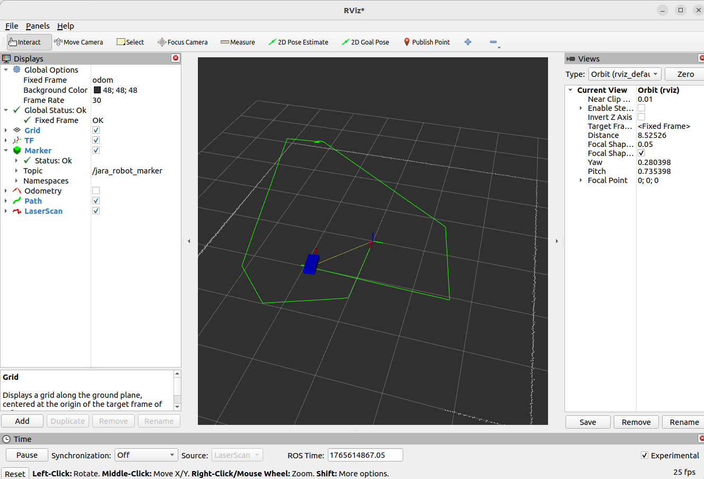
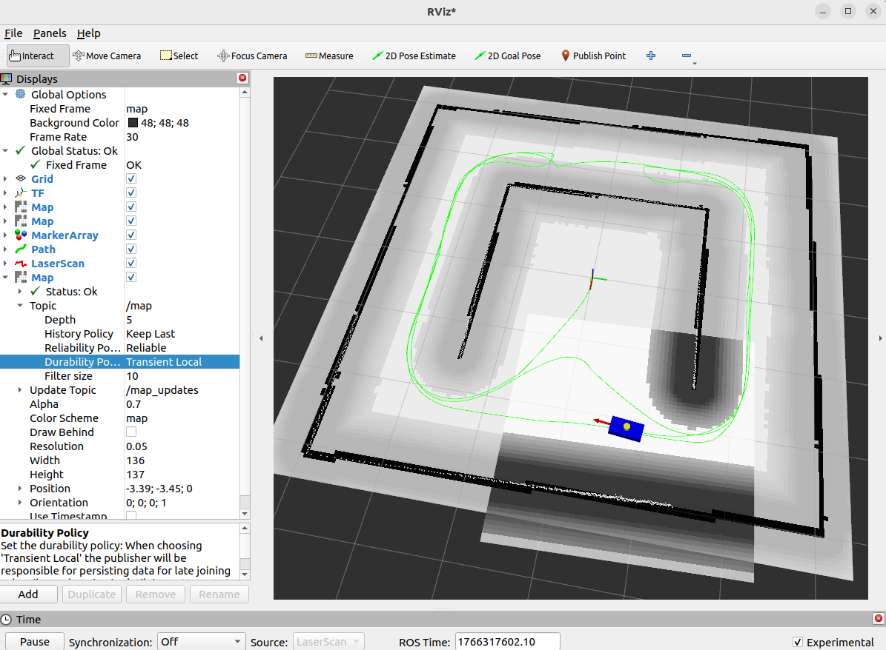

# Jarabot Simulator Navigation (ROS 2 Nav2)

A ROS 2 Humble–based Jarabot simulator with Cartographer SLAM integration.

## Author

**Yonguk Cho** 
Robotics Developer / ROS 2 Engineer  
Creator of Jarabot Simulator

---

### Repository

playros/jarabot-simulator-navigation

## Overview

This project demonstrates autonomous navigation using ROS 2 Nav2
on the Jarabot Simulator, based on a pre-built SLAM map.

It is designed for university-level education and hands-on practice,
covering the complete workflow from:

- Robot simulation
- Map-based localization (AMCL)
- Navigation2 (Nav2)
- RViz-based control and visualization

> Keywords: ROS2 Simulator, Mobile Robot Simulator, LiDAR, RViz2, Odometry, TF, SLAM, Navigation2, Cartographer

---

### Image oof the Jarabot


### Image of the Jarabot simulator operating in RViz



### Image of the Jarabot simulator operating in RViz with Cartographer


### Image of the Jarabot simulator operating in RViz with Navigation




---

## Features

- Map-based autonomous navigation using ROS 2 Navigation2 (Nav2)
- Adaptive Monte Carlo Localization (AMCL) for global localization
- Static map loading via map_server (/map)
- Global path planning (planner_server)
- Local trajectory control (controller_server)
- Behavior Tree–based navigation (bt_navigator)
- Global & Local costmaps with obstacle inflation
- Real-time obstacle avoidance using simulated LiDAR (/scan)
- Velocity command output (/cmd_vel)
- Full TF tree support (map → odom → base_link → base_footprint)
- RViz2-based goal setting and visualization
- Support for 2D Pose Estimate and Nav2 Goal tools
- Lifecycle-managed navigation nodes
- Compatible with simulator-only robots (no URDF required)

---

## Requirements

- Ubuntu 22.04
- ROS 2 Humble
- navigation2, nav2_bringup
- RViz2
- 2D LiDAR-based robot model

```bash
ros2 -h
echo $ROS_DISTRO   # should output: humble
```
---

## Workspace Structure

This repository follows the standard ROS 2 `colcon` workspace layout:

```text
jarabot_sim_ws
├── src
│   ├── jarabot_sim                 # Robot simulator (odometry, lidar, motion)
│   ├── jarabot_sim_cartographer    # SLAM (Cartographer)
│   ├── jarabot_sim_navigation2     # Nav2 configuration
│   │   ├── config                  # Costmap / planner parameters
│   │   ├── launch                  # Nav2 launch files
│   │   └── maps                    # map.yaml + map.pgm
│   ├── jarabot_sim_interfaces      # Custom ROS messages
│   ├── jarabot_sim_rviz.png
│   ├── jarabot_sim_slam.png
│   └── README.md
├── build
├── install
└── log
```

---

⚠️  build/, install/, and log/ directories are generated by colcon
and are not required to be pushed to GitHub.

## Packages Overview
### 1. jarabot_sim

- Core 2D mobile robot simulator package
- Differential-drive robot kinematics
- Simulated 2D LiDAR publishing (/scan)
- Encoder-based odometry publishing (/odom)
- TF tree broadcasting (odom → base_link)
- RViz marker & robot path visualization
- Safety stop node for collision protection
- Keyboard teleoperation support

### 2. jarabot_sim_cartographer

- Cartographer-based SLAM integration package
- 2D Cartographer configuration
- SLAM launch files
- Real-time map generation in RViz
- Map saving using map_saver

### 3. jarabot_sim_interfaces

- Custom message definitions for Jarabot simulato
- Shared message types used across simulator, SLAM, and navigation

### 4. jarabot_sim_navigation2

- ROS 2 Navigation2 (Nav2) integration package
- Map-based autonomous navigation
- AMCL localization (map → odom TF generation)
- Global path planning (planner_server)
- Local trajectory control (controller_server)
- Behavior Tree navigation (bt_navigator)
- Global & local costmap configuration
- RViz-based initial pose and goal setting
- Supports multi-goal navigation and waypoint following

## Required Tools

These are needed to build and manage ROS workspaces.

### Basic Tools

```bash
sudo apt update
sudo apt install -y \
  git \
  python3-colcon-common-extensions \
  python3-rosdep \
  build-essential
```

### Required ROS 2 Packages (Simulator)

Required for simulation, TF handling, and RViz visualization.

```bash
sudo apt install -y \
  ros-humble-rviz2 \
  ros-humble-tf2-ros ros-humble-tf-transformations \
  ros-humble-robot-state-publisher \
  ros-humble-joint-state-publisher \
  ros-humble-nav-msgs \
  ros-humble-sensor-msgs \
  ros-humble-geometry-msgs \
  ros-humble-teleop-twist-keyboard
```
### ROS 2 Core (Required)

Make sure ROS 2 Humble is properly installed and sourced.

```bash
sudo apt update
sudo apt install -y \
  ros-humble-ros-base \
  ros-humble-rclcpp \
  ros-humble-rclpy \
  ros-humble-tf2 \
  ros-humble-tf2-ros \
  ros-humble-tf2-tools
```
### Navigation2 (Nav2) Stack (Required)

Navigation2 is the core framework used for autonomous navigation.

```bash
sudo apt install -y \
  ros-humble-navigation2 \
  ros-humble-nav2-bringup
```

### This installs:

- planner_server
- controller_server
- bt_navigator
- amcl
- map_server
- Costmap and behavior plugins

### SLAM & Map Utilities (Required for map usage)

Used for map generation and loading.

```bash
sudo apt install -y \
  ros-humble-cartographer \
  ros-humble-cartographer-ros \
  ros-humble-nav2-map-server
```

### Summary Table (Student-Friendly)

```bash
ROS 2 Humble             → Core middleware
Navigation2              → Autonomous navigation framework
Cartographer             → SLAM & map generation
Map Server               → Static map loading
RViz2                    → Visualization & goal input
TF2                      → Coordinate transforms
Teleop Twist Keyboard    → Manual robot control
Colcon                   → Workspace build tool
```

## System Architecture

```bash
LaserScan (/scan)
        ↓
AMCL ── map → odom
              ↓
        Odometry
              ↓
         base_link
              ↓
      base_footprint
```

⚠️  Nav2 will NOT work unless this TF chain is complete

## Requirements

- Ubuntu 22.04
- ROS 2 Humble
- navigation2, nav2_bringup
- RViz2
- 2D LiDAR-based robot model

---

## Execution Order (Very Important)

Each command must be run in a separate terminal.

### Installation

```bash
mkdir -p ~/jarabot_sim_ws/src
cd ~/jarabot_sim_ws/src
git clone https://github.com/playros/jarabot-simulator-navigation.git .
```

### Build

```bash
cd ~/jarabot_sim_ws
colcon build
source install/setup.bash
```

### Terminal 1 – Jarabot Simulator

```bash
source ~/jarabot_sim_ws/install/setup.bash
ros2 launch jarabot_sim jarabot_simulator.launch.py
```

This provides:
- /scan
- /odom
- /tf
- Robot motion and sensors

### Terminal 2 – Start Localization (AMCL + Map Server)

```bash
ros2 launch nav2_bringup localization_launch.py \
  use_sim_time:=false \
  map:=/home/ubuntu/jarabot_sim_map/map.yaml \
  autostart:=True
```

This launches:

- map_server
- amcl
- Enables map → odom transform

### Terminal 3 – Publish Static TF (base_link → base_footprint)

```bash
ros2 run tf2_ros static_transform_publisher \
  0 0 0 0 0 0 base_link base_footprint
```

Why this is needed:

- The simulator does not use URDF
- Nav2 requires base_footprint
- This fixes TF chain completion

### Terminal 4 – Verify TF (Localization Check)

```bash
ros2 run tf2_ros tf2_echo map odom
```

- Numbers appear → Localization OK
-  No output → Initial pose not set yet

### Terminal 5 – Launch Navigation2

```bash
ros2 launch nav2_bringup navigation_launch.py \
  use_sim_time:=false \
  autostart:=True
```

This starts:

- planner_server
- controller_server
- bt_navigator
- costmaps

### Terminal 6 – Start RViz

```bash
rviz2
```

---

## RViz Required Settings

### Fixed Frame

```bash
Global Options → Fixed Frame : map
```

### Map Display Settings

```bash
Topic             : /map
Durability Policy : Transient Local
```

Required because map_server uses Transient Local QoS

#### Recommended Displays

- TF
- LaserScan (/scan)
- Global Costmap
- Local Costmap
- RobotModel (optional)

### Setting the Initial Pose (Localization)

#### RViz Toolbar → 2D Pose Estimate

1. Click the robot’s current position on the map
2. Drag the mouse to indicate robot heading
3. Release

➡ AMCL publishes map → odom transform

### Sending a Navigation Goal

#### RViz Toolbar → Nav2 Goal

1. Click target position on the map
2. Drag to set final orientation
3. Release → Robot starts autonomous navigation

---

## Terminal-Based Verification

### Check running nodes

```bash
ros2 node list | grep -E "amcl|planner_server|controller_server|bt_navigator"
```

### Check lifecycle states

```bash
ros2 lifecycle get /planner_server
ros2 lifecycle get /controller_server
ros2 lifecycle get /bt_navigator
```

Expected output:
```bash
active [3]
```

### Check velocity commands

```bash
ros2 topic echo /cmd_vel --once
```

If values appear, Nav2 is actively controlling the robot.

--- 

## Common Issues & Solutions

###  Robot thinks free space is a wall

#### Causes:

- SLAM map and current scan mismatch
- Missing TF
- Costmap inflation too large

#### Solutions:

- Ensure static TF is running
- Verify map resolution
- Adjust costmap parameters

### Robot rotates but does not move

#### Checklist:

- Initial pose set?
- /cmd_vel being published?
- All Nav2 nodes active?
- TF chain complete?

### Recommended Practice Flow

- Launch simulator
- Load map + AMCL
- Set initial pose
- Start Nav2
- Send navigation goals

### Key Takeaways

- SLAM and Navigation are different systems
- Localization is mandatory for Nav2
- TF errors cause most failures
- RViz is a control interface, not just visualization

---

##License

Educational & Research Use
© 2025 Yonguk Cho (PlayROS)

---

- Developed and maintained by **Yonguk Cho**
- **Jarabot Simulator** (also known as **jarabot-simulator** or **jarabot simulator**)


